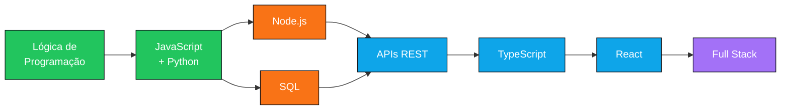

<!-- ══════════════ HEADER ══════════════ -->
<div align="center">


<!-- Cor alterada para Cyan/Azul (#0EA5E9) -->


<br><br>


<br><br>


<br><br>

<!-- Links para arquivos reais de tradução no GitHub -->
<a href="./README.md"></a>
<a href="./README.en.md"></a>
<a href="./README.es.md"></a>

</div>

---

<!-- ══════════════ MENU ══════════════ -->
<a id="menu"></a>

<div align="center">

### 📑 NAVEGAÇÃO

<i>Cada seção tem sua cor — o botão aceso mostra onde você está</i>

<br>

<a href="#sobre"></a>
<a href="#stack"></a>
<a href="#estudos"></a>
<a href="#roadmap"></a>
<a href="#projetos"></a>

<a href="#stats"></a>
<a href="#formacao"></a>
<a href="#idiomas"></a>
<a href="#carreira"></a>
<a href="#contato"></a>

</div>

<br>


---

<!-- ══════════════ 01 · SOBRE MIM ══════════════ -->
<a id="sobre"></a>

<p align="center">
<a href="#menu"></a>
<a href="#sobre"></a>
<a href="#stack"></a>
<a href="#estudos"></a>
<a href="#roadmap"></a>
<a href="#projetos"></a>
<a href="#stats"></a>
<a href="#formacao"></a>
<a href="#idiomas"></a>
<a href="#carreira"></a>
<a href="#contato"></a>
</p>


```yaml
nome:     Gus4Dev
foco:     Desenvolvimento de Software
trilha:   Backend → Full Stack
status:   Estudando e construindo base sólida
objetivo: Primeira oportunidade na área de tecnologia
```

Estudante de **Tecnologia da Informação** com foco em **Desenvolvimento de Software**. Estou construindo minha base por meio de estudos, projetos práticos e preparação para o mercado, buscando **transformar conhecimento em experiência**.

<table>
<tr>
<td width="50%" valign="top">

**🎓 Formação**
<br>Ensino Médio Técnico Integrado em Logística

**💻 Tecnologia**
<br>Estudante de TI pelo **PROA / SENAC**

**⚙️ Desenvolvimento**
<br>JavaScript · Python · HTML · CSS · Lógica

</td>
<td width="50%" valign="top">

**🧠 Fundamentos**
<br>Lógica, resolução de problemas e organização de código

**🚀 Objetivo**
<br>Atuar como Dev **Backend**, evoluindo para Full Stack

**🎯 Próximo passo**
<br>Cursar **Análise e Desenvolvimento de Sistemas**

</td>
</tr>
</table>

---

<!-- ══════════════ 02 · STACK ══════════════ -->
<a id="stack"></a>

<p align="center">
<a href="#menu"></a>
<a href="#sobre"></a>
<a href="#stack"></a>
<a href="#estudos"></a>
<a href="#roadmap"></a>
<a href="#projetos"></a>
<a href="#stats"></a>
<a href="#formacao"></a>
<a href="#idiomas"></a>
<a href="#carreira"></a>
<a href="#contato"></a>
</p>


<div align="center">


</div>

<details open>
<summary><b>📊 Nível atual de cada tecnologia</b></summary>

<br>

| Tecnologia | Nível | Progresso |
|:--|:--|:--|
|  | Intermediário |  |
|  | Intermediário |  |
|  | Em desenvolvimento |  |
|  | Em desenvolvimento |  |
|  | Básico |  |

</details>

---

<!-- ══════════════ 03 · ESTUDOS ══════════════ -->
<a id="estudos"></a>

<p align="center">
<a href="#menu"></a>
<a href="#sobre"></a>
<a href="#stack"></a>
<a href="#estudos"></a>
<a href="#roadmap"></a>
<a href="#projetos"></a>
<a href="#stats"></a>
<a href="#formacao"></a>
<a href="#idiomas"></a>
<a href="#carreira"></a>
<a href="#contato"></a>
</p>


<div align="center">


</div>

> 💡 **Foco do momento:** dominar estruturas condicionais, laços de repetição, funções e organização de código — a base que sustenta tudo depois.

---

<!-- ══════════════ 04 · ROADMAP ══════════════ -->
<a id="roadmap"></a>

<p align="center">
<a href="#menu"></a>
<a href="#sobre"></a>
<a href="#stack"></a>
<a href="#estudos"></a>
<a href="#roadmap"></a>
<a href="#projetos"></a>
<a href="#stats"></a>
<a href="#formacao"></a>
<a href="#idiomas"></a>
<a href="#carreira"></a>
<a href="#contato"></a>
</p>




<div align="center">


</div>

---

<!-- ══════════════ 05 · PROJETOS ══════════════ -->
<a id="projetos"></a>

<p align="center">
<a href="#menu"></a>
<a href="#sobre"></a>
<a href="#stack"></a>
<a href="#estudos"></a>
<a href="#roadmap"></a>
<a href="#projetos"></a>
<a href="#stats"></a>
<a href="#formacao"></a>
<a href="#idiomas"></a>
<a href="#carreira"></a>
<a href="#contato"></a>
</p>


<table>
<tr>
<td width="33%" valign="top" align="center">

### 🏦
**Sistema Bancário**

`Lógica de Programação`

Simulação de operações bancárias com menus, validações e fluxo de navegação.

<br>

<a href="LINK_REPO_1"></a>

</td>
<td width="33%" valign="top" align="center">

### 🧥
**Casaco Solidário**

`Projeto Multidisciplinar`

Solução para arrecadação e distribuição de roupas — do requisito ao MVP.

<br>

<a href="LINK_REPO_2"></a>

</td>
<td width="33%" valign="top" align="center">

### 🌐
**Projetos Web**

`HTML · CSS · JS`

Coleção de exercícios e páginas construídas durante os estudos.

<br>

<a href="LINK_REPO_3"></a>

</td>
</tr>
</table>

<details>
<summary><b>🔎 Detalhes técnicos de cada projeto</b></summary>

<br>

**🏦 Sistema Bancário**
> Variáveis · Condições · Estruturas de repetição · Menus e navegação · Operações bancárias · Organização de código

**🧥 Casaco Solidário**
> Levantamento de requisitos · MVP · Prototipação · Planejamento · Organização de projeto

**🌐 Projetos Web**
> Semântica HTML · Estilização CSS · Manipulação do DOM · Responsividade

</details>

> 🔨 *Novos projetos serão adicionados conforme minha evolução nos estudos.*

---

<!-- ══════════════ 06 · STATS ══════════════ -->
<a id="stats"></a>

<p align="center">
<a href="#menu"></a>
<a href="#sobre"></a>
<a href="#stack"></a>
<a href="#estudos"></a>
<a href="#roadmap"></a>
<a href="#projetos"></a>
<a href="#stats"></a>
<a href="#formacao"></a>
<a href="#idiomas"></a>
<a href="#carreira"></a>
<a href="#contato"></a>
</p>


<div align="center">


</div>

<details>
<summary><b>📈 Mais estatísticas</b></summary>

<br>

<div align="center">


</div>

</details>

---

<!-- ══════════════ 07 · FORMAÇÃO ══════════════ -->
<a id="formacao"></a>

<p align="center">
<a href="#menu"></a>
<a href="#sobre"></a>
<a href="#stack"></a>
<a href="#estudos"></a>
<a href="#roadmap"></a>
<a href="#projetos"></a>
<a href="#stats"></a>
<a href="#formacao"></a>
<a href="#idiomas"></a>
<a href="#carreira"></a>
<a href="#contato"></a>
</p>


| | Formação | Instituição | Status |
|:--:|:--|:--|:--:|
| 🏆 | **Técnico Integrado em Logística** | Ensino Médio |  |
| 💻 | **Tecnologia da Informação** | PROA / SENAC |  |
| 🎯 | **Análise e Desenvolvimento de Sistemas** | — |  |

---

<!-- ══════════════ 08 · IDIOMAS ══════════════ -->
<a id="idiomas"></a>

<p align="center">
<a href="#menu"></a>
<a href="#sobre"></a>
<a href="#stack"></a>
<a href="#estudos"></a>
<a href="#roadmap"></a>
<a href="#projetos"></a>
<a href="#stats"></a>
<a href="#formacao"></a>
<a href="#idiomas"></a>
<a href="#carreira"></a>
<a href="#contato"></a>
</p>


| Idioma | Nível | Progresso |
|:--|:--|:--|
| 🇧🇷 **Português** | Nativo |  |
| 🇪🇸 **Espanhol** | Básico |  |
| 🇺🇸 **Inglês** | Iniciando |  |

> 🎯 **Meta 2025:** chegar ao nível intermediário em inglês técnico — leitura de documentação sem travar.

---

<!-- ══════════════ 09 · CARREIRA ══════════════ -->
<a id="carreira"></a>

<p align="center">
<a href="#menu"></a>
<a href="#sobre"></a>
<a href="#stack"></a>
<a href="#estudos"></a>
<a href="#roadmap"></a>
<a href="#projetos"></a>
<a href="#stats"></a>
<a href="#formacao"></a>
<a href="#idiomas"></a>
<a href="#carreira"></a>
<a href="#contato"></a>
</p>


<div align="center">


</div>

<br>

Meu objetivo é atuar profissionalmente com **Desenvolvimento de Software**, começando com foco em **Backend** e ampliando minhas habilidades até alcançar uma atuação **Full Stack**.

**Estou aberto a:** estágio · programa de trainee · júnior · freelas simples · projetos open source para aprender.

---

<!-- ══════════════ 10 · CONTATO ══════════════ -->
<a id="contato"></a>

<p align="center">
<a href="#menu"></a>
<a href="#sobre"></a>
<a href="#stack"></a>
<a href="#estudos"></a>
<a href="#roadmap"></a>
<a href="#projetos"></a>
<a href="#stats"></a>
<a href="#formacao"></a>
<a href="#idiomas"></a>
<a href="#carreira"></a>
<a href="#contato"></a>
</p>


<div align="center">

<a href="SEU_LINKEDIN_AQUI"></a>
<a href="mailto:SEU_EMAIL_AQUI"></a>
<a href="https://github.com/Gus4Dev"></a>
<a href="SEU_DISCORD"></a>

</div>

---

<!-- ══════════════ FOOTER ══════════════ -->


<div align="center">

<!-- Cor alterada para Cyan/Azul (#0EA5E9) -->


<br><br>

<a href="#menu"></a>


</div>
```

---

### 💡 Dica rápida sobre os arquivos de tradução:
Para os botões de idioma funcionarem perfeitamente no seu repositório:
1. Deixe o código acima dentro do arquivo principal `README.md` (Português).
2. Na mesma pasta do seu repositório, crie um arquivo chamado **`README.en.md`** para a versão em inglês.
3. Crie outro arquivo chamado **`README.es.md`** para a versão em espanhol. 

Ao clicar nas badges no topo do perfil, o GitHub navegará instantaneamente entre as versões!
